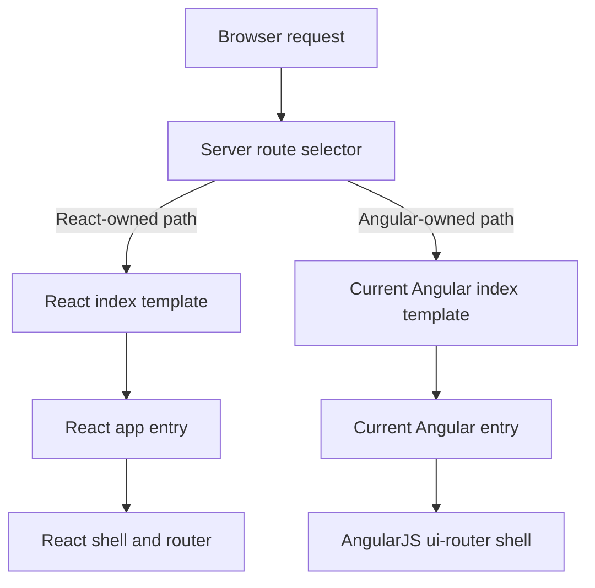

# React-Owned Incremental Root Plan

## Goal

Create a first migration step where selected routes can boot into a React-owned app root, while existing AngularJS routes continue to boot into the current Angular app. Whole-page refreshes between React-owned and Angular-owned route groups are acceptable, so the plan avoids Angular islands inside React and avoids running two routers in one page.



## Scope

- Add a React-owned root for a small initial route group, preferably low-risk routes that already render React components today.
- Keep the current Angular app and `ui-router` as the owner of all non-migrated routes.
- Use normal `<a href="/...">` navigation when moving between React-owned and Angular-owned route groups.
- Keep existing backend APIs and URL paths.
- Keep current dependency versions as much as possible: React 17, React Query 3, Webpack 4, Babel 7.
- Wrap current globals (`user`, `settings`, `env`, `title`, `isNativeMobileApp`, etc.) behind a React bootstrap module and providers.
- Add unit tests and React Testing Library tests for new React-only code introduced by this migration step.
- Keep existing e2e tests in place where possible; update selectors only when route markup changes require it, and add new e2e tests for new behavior or uncovered migration paths.

## Key Existing Files

- Current Angular entry: [config/webpack/entries/main.js](config/webpack/entries/main.js)
- Current Webpack entry config: [config/webpack/webpack.config.js](config/webpack/webpack.config.js)
- Current Angular bootstrap: [modules/core/client/app/init.js](modules/core/client/app/init.js)
- Current server catch-all: [modules/core/server/routes/core.server.routes.js](modules/core/server/routes/core.server.routes.js)
- Current server render function: [modules/core/server/controllers/core.server.controller.js](modules/core/server/controllers/core.server.controller.js)
- Current Angular index outlet: [modules/core/server/views/index.server.view.html](modules/core/server/views/index.server.view.html)
- Current Angular-aware layout/globals: [modules/core/server/views/layout.server.view.html](modules/core/server/views/layout.server.view.html)
- Current settings wrapper: [modules/core/client/services/settings.client.service.js](modules/core/client/services/settings.client.service.js)
- Current auth wrapper: [modules/users/client/services/authentication.client.service.js](modules/users/client/services/authentication.client.service.js)

## Implementation Plan

1. Define route ownership for the first React-owned group.

   Start with routes that already mostly render React and have low Angular-controller dependency. Good candidates are static/support/statistics/admin pages. Keep profile, search, signup, offers, and profile edit in Angular for now.

2. Add a server-side route selector.

   Update the frontend catch-all path handling so React-owned URLs render a React index template and all other frontend URLs continue rendering the existing Angular index template. Keep API/static/not-found handling unchanged.

3. Add a React index template.

   Create a React-specific server template with a `<div id="root"></div>` style root. Reuse the same backend render variables and bootstrap data as the Angular layout initially, but do not include Angular-specific `ng-controller`, `data-ui-view`, or Angular shell markup.

4. Add a React Webpack entry.

   Keep the existing Angular `main.js` entry intact. Add a separate React entry that imports shared global styles, initializes i18n, reads bootstrap data through a wrapper, and calls `ReactDOM.render(<ReactApp />)`.

5. Wrap bootstrap globals.

   Add a small React-side bootstrap module that reads the existing server-injected values in one place and applies defaults. New React shell code should not read `window.user`, `window.settings`, or `window.isNativeMobileApp` directly.

   Conceptual shape:

   ```js
   export function getBootstrapData() {
     return {
       title: window.title || 'Trustroots',
       settings: {
         flashTimeout: 6000,
         ...(window.settings || {}),
       },
       env: window.env || 'production',
       isNativeMobileApp: Boolean(window.isNativeMobileApp),
       user: window.user || null,
       facebookAppId: window.facebookAppId,
       gaId: window.gaId,
     };
   }
   ```

6. Add React providers.

   Introduce top-level providers for app bootstrap data, auth/current user, settings, and a single root `QueryClientProvider`. Route components should consume these through hooks rather than direct globals.

7. Add a minimal React router and route metadata.

   For the first step, either use a React 17-compatible router such as `react-router-dom@5.x` or a small internal route matcher. Route metadata should cover page title, auth requirement, admin role requirement, footer/header visibility, and whether the route belongs to React or Angular.

8. Implement cross-app navigation rules.

   Within React-owned routes, client-side navigation is allowed. Links from React-owned routes to Angular-owned routes should use normal page navigation. Angular-owned routes can link to React-owned routes with normal links as well.

9. Port the first React-owned route group.

   Move only the selected route group into the React route table. Reuse existing React components where possible. Preserve current URLs so direct links and bookmarks keep working.

10. Verify behavior.

Test direct page loads for React-owned and Angular-owned routes, navigation between route groups, logged-in/logged-out behavior, page title, asset loading, shared CSS, and production/dev server behavior.

11. Add focused test coverage for new React code.

Unit test pure route ownership, bootstrap parsing/defaulting, route matching, and route metadata helpers. Use React Testing Library for new React shell components, providers, guards, layout behavior, and route rendering. This testing requirement applies to new React code introduced by this step, not to rewriting existing Angular tests preemptively.

12. Preserve and adapt e2e coverage.

Existing e2e tests should ideally continue to run unchanged because URLs and user-facing behavior should be preserved. If converted React markup changes test selectors, update selectors in the existing e2e tests. Add new e2e tests only where the React-owned root introduces new behavior or where existing tests do not cover direct React-page loading, React-to-Angular navigation, Angular-to-React navigation, or route ownership boundaries.

## Testing Strategy

- Unit tests should cover pure new React migration helpers: bootstrap data wrapper, route ownership matcher, route metadata helpers, auth/admin guard decisions, and cross-app navigation classification.
- React Testing Library tests should cover new React shell behavior: providers, current user/settings availability, route rendering, redirects/guards, header/footer visibility, page title updates, and full-page-link behavior for Angular-owned paths.
- Existing e2e tests should remain the primary verification for preserved user journeys. They should either pass unchanged or be updated only for intentional selector/markup changes.
- New e2e tests should be added for migration-specific coverage gaps, especially direct loads of React-owned URLs and navigation across React-owned and Angular-owned route groups.
- Avoid rewriting stable Angular tests unless the tested route or behavior is actually moved into the React-owned root.

## Initial Route Group Recommendation

Use one of these as the first React-owned group:

- Static/public pages: `/rules`, `/privacy`, `/faq`, `/foundation`, `/media`, `/volunteering`, `/guide`, `/team`, `/contribute`.
- Support/statistics: `/support`, `/contact`, `/statistics`.
- Admin pages that already render React components, if admin testing coverage is easy.

Recommended first choice: static/public pages plus support/statistics. This exercises the React shell, bootstrap data, routing, CSS, i18n, and direct loads without starting with the hardest auth/form/map flows.

## Risks And Mitigations

- Server route ownership can drift from client route ownership. Mitigate with a single shared route ownership list or generated server matcher where practical.
- React and Angular shells can diverge visually. Mitigate by importing the same global Less/CSS into the React entry initially.
- Auth redirects can behave differently between apps. Mitigate by implementing React route guards from the current Angular `requiresAuth` and `requiresRole` behavior before moving protected routes.
- Bootstrap globals can keep spreading. Mitigate by enforcing a rule that new React code reads globals only through the bootstrap provider/hooks.
- Bundle setup can accidentally load both apps. Mitigate by using separate templates and entrypoints so React pages load only the React entry and Angular pages load only the Angular entry.
- Whole-page transitions can feel inconsistent. Mitigate by using plain links deliberately and preserving URLs, header styling, and layout conventions.

## Out Of Scope For This First Step

- Removing Angular dependencies.
- Hosting Angular pages inside React.
- Migrating search map, profile edit, signup, offers, or upload-heavy flows.
- Replacing all `$resource` services.
- Reworking backend API shapes.
- Upgrading React/Webpack/Babel beyond what is needed for the second entry.

## Success Criteria

- At least one route group boots through a React-owned root on direct page load.
- Non-migrated routes continue booting through the Angular app.
- React code uses wrapped bootstrap data, not direct global reads.
- Navigation between React and Angular route groups works through full page loads.
- Shared CSS, i18n, current user data, and settings are available in the React shell.
- Existing Angular behavior remains unchanged for Angular-owned routes.
