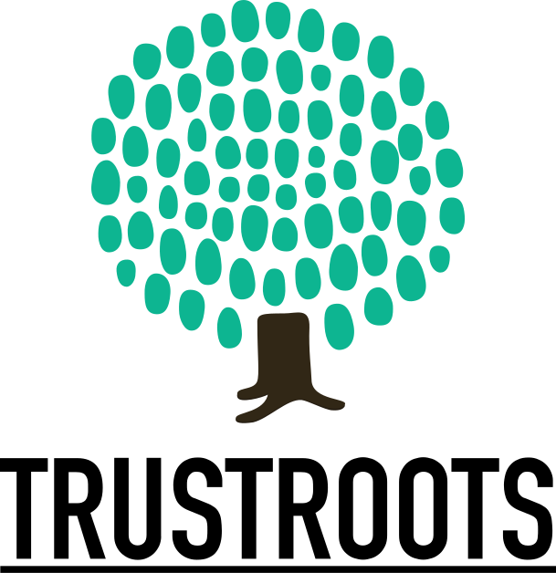

   
  
   
  <em>Travellers' community. Sharing, hosting and getting people together.</em>
   

## Android preview

Download the latest signed Android APK from [GitHub Releases](https://github.com/Trustroots/trustroots/releases). The badge updates automatically when a new Android preview is published after a successful build on `main`.

To receive Android preview updates through Obtainium, [add Trustroots to Obtainium](obtainium://app/%7B%22id%22%3A%22org.trustroots.android%22%2C%22url%22%3A%22https%3A%2F%2Fgithub.com%2FTrustroots%2Ftrustroots%22%2C%22author%22%3A%22Trustroots%22%2C%22name%22%3A%22Trustroots%20Android%20preview%22%2C%22additionalSettings%22%3A%22%7B%5C%22includePrereleases%5C%22%3Atrue%2C%5C%22filterReleaseTitlesByRegEx%5C%22%3A%5C%22%5EAndroid%20preview%20%5C%22%2C%5C%22apkFilterRegEx%5C%22%3A%5C%22%5Etrustroots-android-.*%5C%5C%5C%5C.apk%24%5C%22%7D%22%7D). Confirm the import in Obtainium; it follows the signed APKs from GitHub prereleases. If the link does not open, add `https://github.com/Trustroots/trustroots` in Obtainium and enable prereleases.

Zapstore publishing is [configured for the Android preview](zapstore.yaml). A Trustroots publisher must complete the one-time identity and signing-certificate link before its listing appears.

See the [Android distribution overview](apps/android/README.md#android-preview-distribution) for the status of other app stores.

## Current development

Trustroots is actively developed again. After a period focused mainly on
maintenance from 2022 to June 2026, we welcome contributions and improvements.

Current areas of work include:

- Simplifying older code and reducing duplication.
- Improving the development setup and updating dependencies.
- Continuing the move to React and TypeScript where it makes sense.
- Developing the Nostr/Nostroots integration.
- Making Trustroots easier to run independently and adapt for forks.

See [CONTRIBUTING.md](CONTRIBUTING.md) for contribution guidelines and tests,
and [team.trustroots.org](https://team.trustroots.org/) for more ways to help.

## Medium term plans

Our medium term plan is decentralisation through the Nostr protocol. See https://github.com/Trustroots/nostroots.

We are also open to improvements that [make trustroots forkable](https://github.com/Trustroots/trustroots/issues/2669).

## Development setup

See the [development setup guide](docs/development.md) for prerequisites and
instructions for running Trustroots locally.

## Production builds

See the [Docker deployment guide](deploy/docker/README.md) for instructions to
build and push production images.

## Licence

The software in this repository is licensed under the [GNU Affero General
Public License, version 3](LICENSE.md). Images and community logos may have
separate copyright or licence terms. See the
[contributor asset guide](docs/Contributor-assets.md) for photo credits and
permissions. Third-party names and logos remain the property of their
respective owners.
